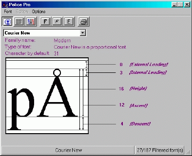



## PolicePro \(fontPro\)

### Description

It's a deja vue app, but i add some new options. It is a font visualization program that give you infos about all the fonts that you have. You can also print font or a catalog of your font. It's a must see and of course you have to vote...it's free but i have to be encourage.I made it in two languages (french and english).
 
### More Info
 

             |
---                |---
**Submitted On**   |2002-06-23 15:45:30
**By**             |[Les Productions UnderDog](https://github.com/Planet-Source-Code/PSCIndex/blob/master/ByAuthor/les-productions-underdog.md)
**Level**          |Advanced
**User Rating**    |4.7 (14 globes from 3 users)
**Compatibility**  |VB 4\.0 \(32\-bit\), VB 5\.0, VB 6\.0
**Category**       |[Complete Applications](https://github.com/Planet-Source-Code/PSCIndex/blob/master/ByCategory/complete-applications__1-27.md)
**World**          |[Visual Basic](https://github.com/Planet-Source-Code/PSCIndex/blob/master/ByWorld/visual-basic.md)
**Archive File**   |[PolicePro\_978536232002\.zip](https://github.com/Planet-Source-Code/les-productions-underdog-policepro-fontpro__1-36186/archive/master.zip)

